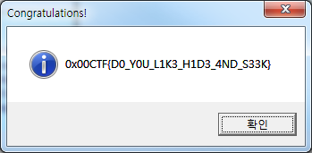

Challenge-003
======================

-----------------
## Description
```

```

## 풀이

Challenge-003.exe를 실행하면 아무것도 나타나지 않는다. 이 프로그램은 실행결과가 가시적으로 나타나지 않는 프로그램인듯하여 바로 분석에 들어갔다. 분석하는 도중에 Challenge-003.exe라는 실행파일이 하나 더 생기는 것을 확인했고 Challenge-003 프로그램은 자식 프로세스를 생성하는 프로그램으로 추측이 된다. 
```
.text:004024AC mov     [esp+578h+nSize], 0Dh
.text:004024B4 lea     ecx, [ebp+lpLibFileName]
.text:004024BA mov     [esp+578h+lpFilename], offset unk_425155
.text:004024C2 mov     eax, [ebx+0Ch]
.text:004024C5 mov     [esp+578h+hModule], eax
.text:004024C8 call    sub_402748
.text:004024CD lea     ecx, [ebp+lpModuleName]
.text:004024D3 mov     esi, [ebp+lpLibFileName]
.text:004024D9 sub     esp, 0Ch
.text:004024DC mov     [esp+578h+nSize], 9
.text:004024E4 mov     [esp+578h+lpFilename], offset unk_4250E6
.text:004024EC mov     eax, [ebx+0Ch]
.text:004024EF mov     [esp+578h+hModule], eax
.text:004024F2 call    sub_4027A0
.text:004024F7 mov     eax, [ebp+lpModuleName]
.text:004024FD sub     esp, 0Ch
.text:00402500 mov     [esp+578h+hModule], eax ; lpLibFileName
.text:00402503 call    LoadLibraryW
.text:00402508 push    edi
.text:00402509 mov     [esp+578h+lpFilename], esi ; lpProcName
.text:0040250D mov     [esp+578h+hModule], eax ; hModule
.text:00402510 call    GetProcAddress
.text:00402515 push    edx
.text:00402516 mov     esi, eax
.text:00402518 push    edx
.text:00402519 lea     ecx, [ebp+lpModuleName]
.text:0040251F call    sub_41A510
.text:00402524 lea     ecx, [ebp+lpLibFileName]
.text:0040252A call    sub_41C8B0
.text:0040252F mov     eax, [ebp+var_53C]
.text:00402535 mov     [esp+578h+hModule], eax
.text:00402538 call    esi							// 새로 생성된 challenge-003 파일이
.text:0040253A inc     eax							// 사라지는 루틴
.text:0040253B push    ecx
.text:0040253C jz      loc_401FDC
```
중간에 00402538부분에서 esi를 call하면 자식 프로세스가 사라지는 것을 확인했다. 이 부분이 자식 프로세스가 실행이 되고 종료하는 신호를 받는 부분인듯하다. 이 부분에 bp를 걸고 자식 프로세스를 분석하려고 한다.
```
<IDA에서 자식 프로세스 분석>
1. 새로운 IDA 창을 띄운다. 
2. Debugger -> attach -> 원하는 파일 선택한다.
(이 문제의 경우 아래에 과정이 필요)
3. Modules 창(디버거 -> 디버거 윈도우) -> challenge-003.exe에 오른쪽 마우스 후 'break on access'를 선택한다.
4. 부모 프로세스에서 한단계 실행(F8)한다.
5. 자식 프로세스를 분석한다.
```
자식 프로세스를 분석하려고 하지만 바이너리가 전부 Undefined되있으므로 전부 코드패치를 해준다. 코드패치를 해주면 아래와 같은 코드를 찾을 수 있다.

```
challenge_003.exe:00401200 sub_401200 proc near
challenge_003.exe:00401200
challenge_003.exe:00401200 var_34= byte ptr -34h
challenge_003.exe:00401200 var_12= byte ptr -12h
challenge_003.exe:00401200 var_4= dword ptr -4
challenge_003.exe:00401200
challenge_003.exe:00401200 push    ebp
challenge_003.exe:00401201 mov     ebp, esp
challenge_003.exe:00401203 sub     esp, 34h
challenge_003.exe:00401206 mov     eax, dword_498EA4
challenge_003.exe:0040120B xor     eax, ebp
challenge_003.exe:0040120D mov     [ebp+var_4], eax
challenge_003.exe:00401210 call    sub_401090
challenge_003.exe:00401215 test    al, al
challenge_003.exe:00401217 jnz     short loc_40124F
challenge_003.exe:00401219 push    30h
challenge_003.exe:0040121B lea     eax, [ebp+var_34]
challenge_003.exe:0040121E push    0
challenge_003.exe:00401220 push    eax
challenge_003.exe:00401221 call    sub_456760
challenge_003.exe:00401226 add     esp, 0Ch
challenge_003.exe:00401229 lea     eax, [ebp+var_34]
challenge_003.exe:0040122C push    eax
challenge_003.exe:0040122D sub     esp, 8
challenge_003.exe:00401230 call    sub_401000
challenge_003.exe:00401235 add     esp, 0Ch
challenge_003.exe:00401238 mov     [ebp+var_12], 0
challenge_003.exe:0040123C lea     eax, [ebp+var_34]
challenge_003.exe:0040123F push    40h
challenge_003.exe:00401241 push    offset aCongratulation ; "Congratulations!"
challenge_003.exe:00401246 push    eax
challenge_003.exe:00401247 push    0
challenge_003.exe:00401249 call    off_46F15C
```
00401200에 bp를 걸고 동적분석을 계속한다. 이때 중간의 jnz는 패치해서 뛰어넘어주면 플래그가 들어있는 메세지박스를 띄워준다.

  
